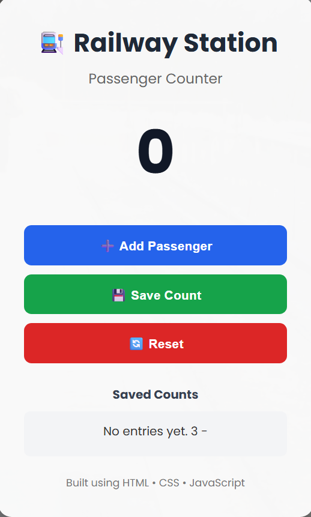

# 🚉 Railway Station Passenger Counter

A simple and responsive Passenger Counter web application built using **HTML**, **CSS**, and **JavaScript**.

This project demonstrates fundamental front-end web development concepts including DOM manipulation, event handling, responsive layouts, and modern CSS styling.

---

## 📸 Preview



---

## ✨ Features

- Count passengers entering the station
- Save previous passenger counts
- Reset the counter
- Responsive card layout
- Modern UI with hover animations
- Background image with overlay
- Beginner-friendly JavaScript implementation

---

## 🛠️ Technologies Used

- HTML5
- CSS3
- JavaScript (ES6)

---

## 📂 Project Structure

```
Railway-Station-Passenger-Counter/
│
├── index.html
├── index.css
├── index.js
├── station.jpg
├── preview.png
└── README.md
```

---

## 🚀 Getting Started

### Clone the repository

```bash
git clone https://github.com/yourusername/Railway-Station-Passenger-Counter.git
```

### Navigate to the project

```bash
cd Railway-Station-Passenger-Counter
```

### Install dependencies

```bash
npm install
```

### Start the development server

```bash
npm run dev
```

---

## 📚 Learning Objectives

This project was created to practice:

- HTML page structure
- CSS layouts and styling
- Flexbox
- Buttons and hover effects
- DOM Manipulation
- JavaScript Functions
- Variables
- Event Handling
- Updating page content dynamically

---

## 💡 Future Improvements

- Dark Mode
- Passenger statistics
- Local Storage support
- Sound effects
- Animated counter
- Live date & time
- Passenger history table

---

## 👨‍💻 Author

**Muhammad Ahmad**

Computer Science Student

Learning Front-End & Full-Stack Web Development.

---

## 📄 License

This project is created for learning purposes and is open for educational use.